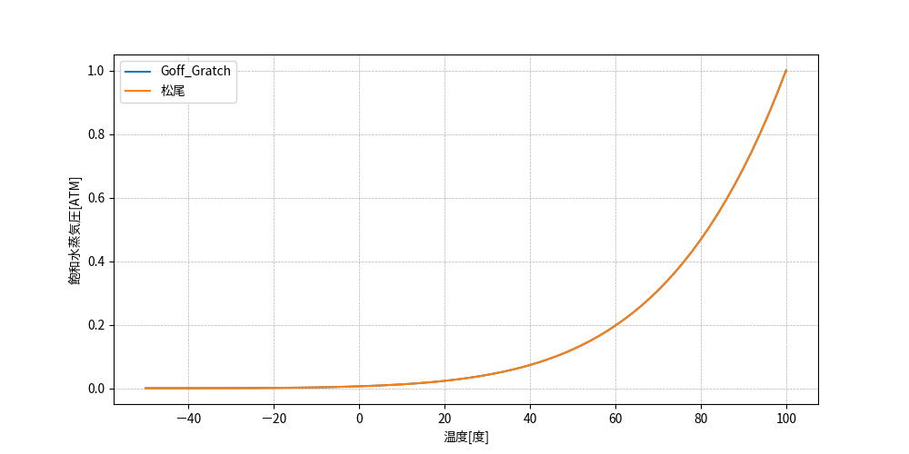

== PS: 飽和水蒸気圧の算出

=== 目的

温度[℃]を与えて、そのときの飽和水蒸気圧[atm]を算出する。 +
2つのロジックを用意している。

=== 入出力

.入力
[options="header" cols="1,4,2"]
|=================================
|変数名|説明|単位
|stem:[T]| 温度 | ℃
|=================================

.出力
[options="header" cols="1,4,2"]
|=================================
|変数名|説明|単位
|stem:[P_{s}] | 飽和水蒸気圧 | atm |
|=================================

=== 使用する関数

なし

=== 計算ロジック

==== Goff-Gratch 原式

stem:[T]が0℃以上である場合は、次式を適用する。
====
[stem]
++++++++++++++++++++++++++++++++++++++++++++
Z = \frac{373.16}{273.16 + T} \\
Y = Z - 1.0 \\
X = -7.90298Y + 5.02808\log_{10}(Z) - 1.3816 \cdot 10^{-7}(10^{11.344\frac{Y}{Z}}-1.0) + 8.1328 \cdot 10^{-3}(10^{-3.49149Y}-1) \\
P_{S} = 10^{ X }
++++++++++++++++++++++++++++++++++++++++++++
====

stem:[T]が0℃より小さい場合は、次式を適用する。
====
[stem]
++++++++++++++++++++++++++++++++++++++++++++
Z = \frac{273.16}{273.16 + T} \\
Y = Z - 1.0 \\
Z = -9.09718Y - 3.56654\log_{10}(Z) + 0.876793\frac{Y}{Z} - 2.219877 \\
P_{S} = 10^{ X }
++++++++++++++++++++++++++++++++++++++++++++
====

==== 松尾の多項近似式

stem:[T]が0℃以上である場合は、次式を適用する。
====
[stem]
++++++++++++++++++++++++++++++++++++++++++++
A_{0} = -5.111336 \\
A_{1} = 7.265429 \cdot 10^{-2} \\
A_{2} = -2.986334 \cdot 10^{-4} \\
A_{3} = 1.113417 \cdot 10^{-6} \\
A_{4} = -3.429809 \cdot 10^{-9} \\
A_{5} = 6.181450 \cdot 10^{-12} \\

P_{S} = \exp(A_{0}+T(A_{1}+T(A_{2}+T(A_{3}+T(A_{4}+A_{5}T))))
++++++++++++++++++++++++++++++++++++++++++++
====

stem:[T]が0℃より小さい場合は、次式を適用する。
====
[stem]
++++++++++++++++++++++++++++++++++++++++++++
B_{0} = -5.111472 \\
B_{1} = 8.233478 \cdot 10^{-2} \\
B_{2} = -3.069412 \cdot 10^{-4} \\
B_{3} = 9.639090 \cdot 10^{-7} \\
B_{4} = -6.426140 \cdot 10^{-9} \\

P_{S} = \exp(B_{0}+T(B_{1}+T(B_{2}+T(B_{3}+B_{4}T))))
++++++++++++++++++++++++++++++++++++++++++++
====

=== 計算例

=== 補足説明

* 飽和水蒸気圧の算出式として2種類（Goff-Gratch原式、松尾の近似式）を用意しているが、
Goff-Gratch原式の方は式が複雑な形であるので、多少の計算時間を要す。松尾の近似式の方は、
-50℃≦stem:[T]≦100℃においては最小相対誤差stem:[1.5×10^(-5)]の精度であり、計算時間も1/3程度である。
* 松尾のmini-max多項式近似式は微分が容易であるんおで、newton法による解法への応用が便利である。

=== ソースコード

[source,python]
----
include::../PS.py[]
----
